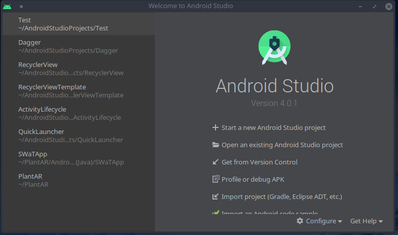
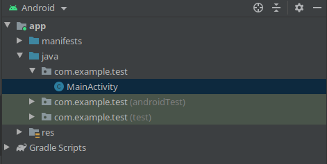
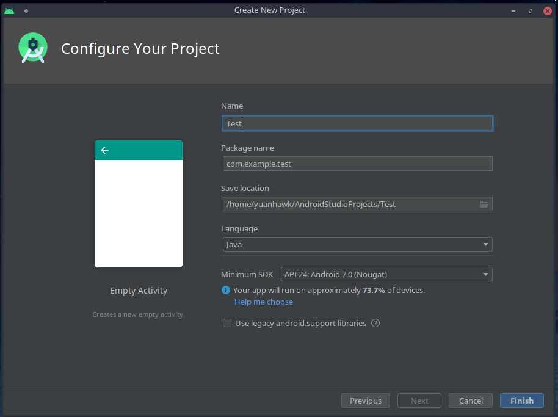
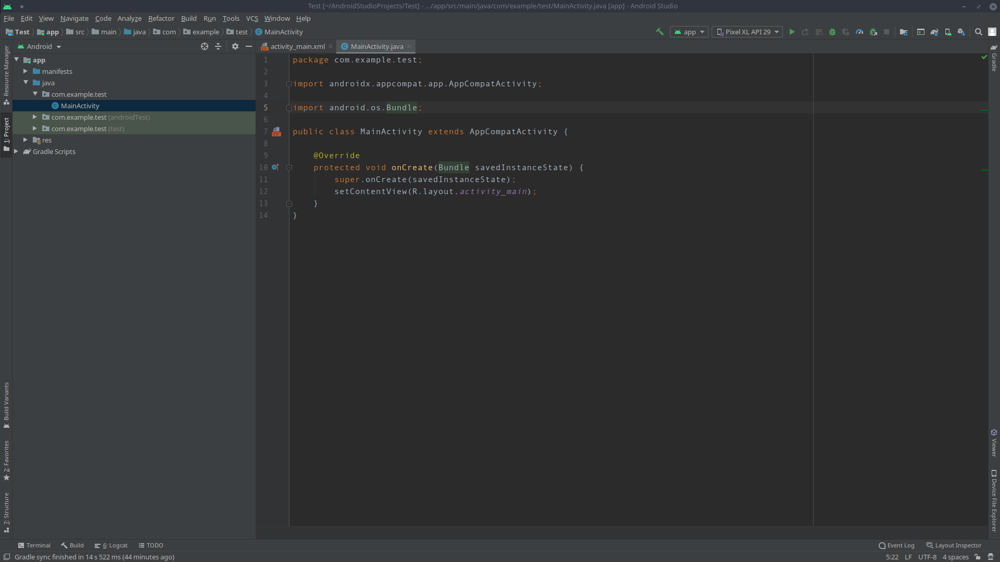
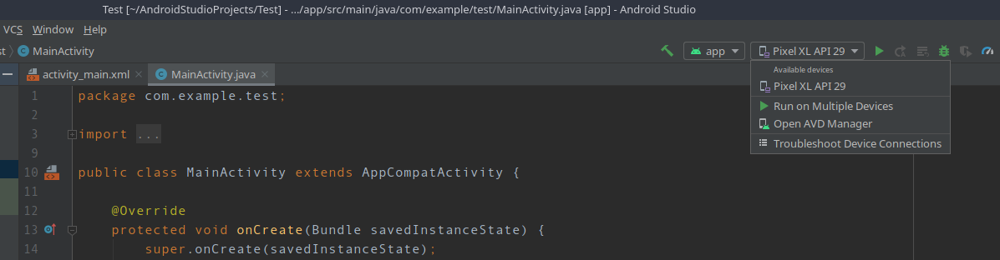
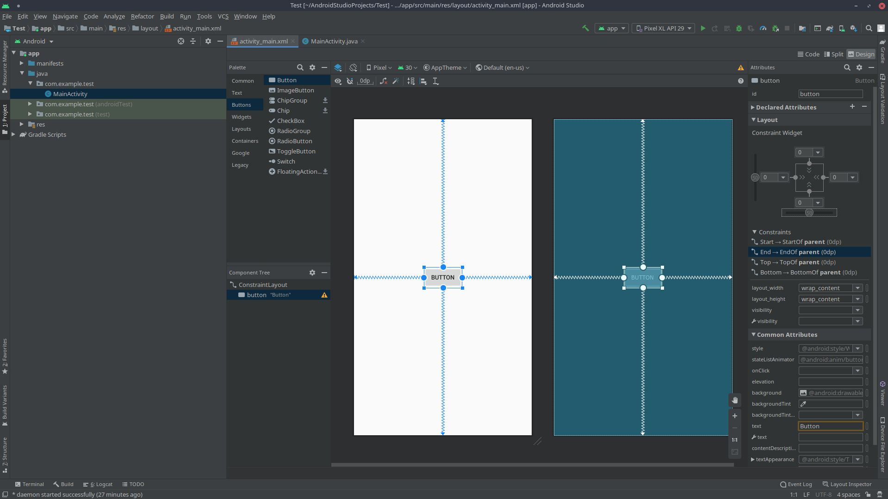
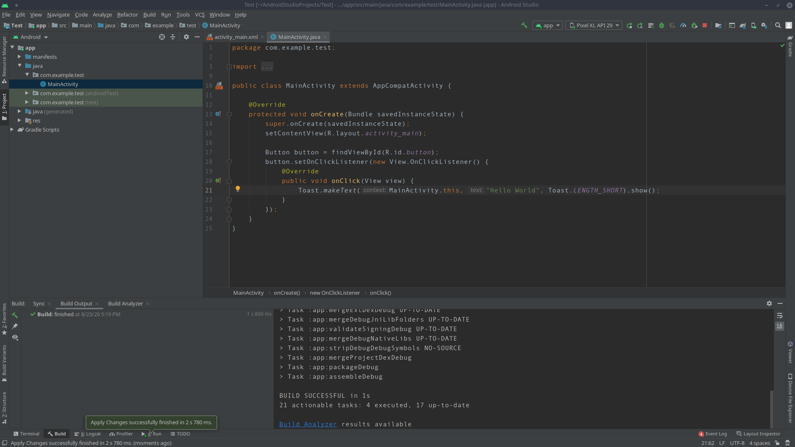
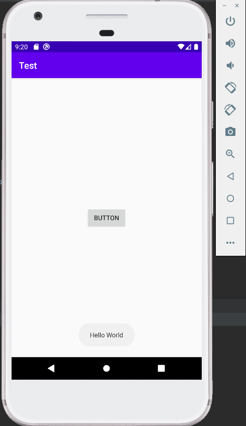

# Java Android Crash Course

Author: Tan Li Yuan <br>
Contains syntax for Java Android

### 1. Pre-Requisites<br>
#### Good to know
* OOP
* Some Java Syntax, hopefully you are fluent in it...

#### Installation of Android Studio (preferred)
You can choose any IDE of your own (Eclipse/Intellij), but you are on your own for this course



The latest android studio version is 4.0.1, but you can choose 3.5.3 or 3.6.3 if you prefer. It's pretty much the same.
The new functionalities in 4.0.1 would not matter that much if you are still new to Android.

Select 'Start a new Android Studio project' if you have no existing project or if you wish to 'Open an existing project
Android Studio project', just select the 2nd option.



Select Empty Activity, please do not select other templates to avoid confusion (there are many pre-written codes and it
is not meant for beginners)



Create Name, Package Name <br>
By convention name is Capitalized 'MyFirstApp', package name is uri in reverse 'com.example.test',
assuming if your uri is test.example.com on your website, remember to create a unique package name if you ever intend to
post your app to play console

Language <br>
Choose Java, not teaching Kotlin for this course

Minimum SDK <br>
Whatever you prefer, I am not picky for this workshop, but if you ask me what is a good number, use 24 (N)

FYI <br>
If you use Android, and you do not know which version you are on, go figure it out yourself, that's your homework. If
you intend to learn android, but you don't know which android version you are on. Ahem, to put it bluntly, you are coming
to learn how to cook, but you don't know your knife well!

* Sdk 24, 25 Android 7 (Nougat)
* Sdk 26, 27 Android 8 (Oreo)
* Sdk 28 Android 9 (Pie)
* Sdk 29 Android 10 (Q)
* Sdk 30 Android 11 (R) - Btw if you didn't know R is in beta phase, go check it out if you wanna know about it!

Click finish

### 2. Basic Android Programming Knowledge


Before proceeding, please configure your emulator if you have not done so! <br>
 <br>
Select Create Virtual Device > Any phone device of your choice (Next) > Download Q or lower API level to be safe (Next) > Next > Finish

#### MainActivity
```
package com.example.test;

import androidx.appcompat.app.AppCompatActivity;

import android.os.Bundle;

public class MainActivity extends AppCompatActivity {

    @Override
    protected void onCreate(Bundle savedInstanceState) {
        super.onCreate(savedInstanceState);
        setContentView(R.layout.activity_main);
    }
}
```
Every activity starts off with this boilerplate codes containing your activity.

---
Package containing your java codes
```package com.example.test;```

Importing java packages is similar to importing a python lib.<br>
```
import androidx.appcompat.app.AppCompatActivity;

import android.os.Bundle;
```

The AppCompatActivity contains all the necessary codes for you to create a full activity. It is the base class (superclass) for your
MainActivity ```MainActivity extends AppCompatActivity```. The most commonly used ones include:

```
onCreate()
onStart()
onResume()
onPause()
onStop()
onDestroy()
```
These are the enclosed classes for an Activity Lifecycle.

The Android OS Bundle contains essential codes for data storing, specifically used when you wish to pass data between 
activities and beyond activity lifecycles.

---

### XML
What is android without its static layout?<br>
For those who coded Kivy before congratulations! You have gotten rid of lousy .kv structure, and you are
welcome to use the drag-n-drop ConstraintLayout. Beautiful isn't it?

For those wondering where is the xml file, just Ctrl/Cmd-click ```R.layout.activity_main``` or you can select <br>

```
<?xml version="1.0" encoding="utf-8"?>
<androidx.constraintlayout.widget.ConstraintLayout xmlns:android="http://schemas.android.com/apk/res/android"
    xmlns:app="http://schemas.android.com/apk/res-auto"
    xmlns:tools="http://schemas.android.com/tools"
    android:layout_width="match_parent"
    android:layout_height="match_parent"
    tools:context=".MainActivity">

    <TextView
        android:layout_width="wrap_content"
        android:layout_height="wrap_content"
        android:text="Hello World!"
        app:layout_constraintBottom_toBottomOf="parent"
        app:layout_constraintLeft_toLeftOf="parent"
        app:layout_constraintRight_toRightOf="parent"
        app:layout_constraintTop_toTopOf="parent" />

</androidx.constraintlayout.widget.ConstraintLayout>
```


If you dig into the layout palette, you will see various types of layouts:
* ConstraintLayout - will be using this on the 1st day
* LinearLayout - will be using this on 2nd day
* RelativeLayout - will be using this on 2nd day
* FrameLayout - won't be using for this course, best used for fragments

The 1st day is a babysitter course, so you get to slack off on xml coding hurrah! But on 2nd & 3rd day, due to the
challenge of conducting this workshop, I will be using LinearLayout & RelativeLayout.

*If you prefer codes (manual control) like me, then you will be fine, people who like the easy way might not like
later 2 layouts*

Btw if you are reading this, and you skipped the lesson, just go watch the video at your owntime on how to drag-n-drop,
it is really simple and you might want to try it out yourself, and if you are wondering why I won't explain beyond here,
there is really too much to write.

---

### Hello World App

 <br>


```
    @Override
    protected void onCreate(Bundle savedInstanceState) {
        super.onCreate(savedInstanceState);
        setContentView(R.layout.activity_main);

        Button button = findViewById(R.id.button);
        button.setOnClickListener(new View.OnClickListener() {
            @Override
            public void onClick(View view) {
                Toast.makeText(MainActivity.this, "Hello World", Toast.LENGTH_SHORT).show();
            }
        });
    }
```

When creating a button widget, do link it by using ```findViewById()``` followed by its id ```R.id.button```. If you have
created websites before, it bears resemblance to the <id> tag and you have to link it your js script to create a response.
Similarly in Java, you have to link it to be able to code in Java.

```button.setOnClickListener``` is used to create an interface within the class and it implements the ```onClick``` 
method within an Anonymous Class ```new View.OnClickListener```. If you don't understand anything, just think of as a
contract that you written for the button to elicit a response when you 'click' it.

```Toast.makeText()``` is just a small popup message that you want to show in your app. Simple right? Unfortunately, it
ain't that simple as the codes underneath the hood is ridiculously difficult, and it has been abstracted away from us.
Anyways, congratulation! You have created your first app.



---

####My First App
Please refer to the code package for the full codes, I will be explaining the code here.

```
    public void add(View view) {
        int n1, n2;
        n1 = getNumber(num1);
        n2 = getNumber(num2);

        int r = n1 + n2;
        result.setText(String.valueOf(r));
    }

    private int getNumber(EditText text) {
        int num = 0;
        try {
            num = Integer.parseInt(String.valueOf(text.getText()));
        } catch (NumberFormatException e) {
            e.printStackTrace();
        }
        return num;
    }
```

In the add method, I get the integers by parsing strings taken from num1 & num2, and used the try-catch to catch any input
errors. I avoided app crashes just by catching the error, so if you don't know how to catch errors, please go study them. 
In the next portion, I converted my int back to String and then set my result using that. Simple isn't it? 


Where did I create my button? Make a guess!

The answer is: XML layout
```
    <Button
        android:id="@+id/add"
        android:layout_width="wrap_content"
        android:layout_height="wrap_content"
        android:layout_marginTop="60dp"
        !!!android:onClick="add"
        android:text="ADD"
        app:layout_constraintEnd_toEndOf="parent"
        app:layout_constraintStart_toStartOf="parent"
        app:layout_constraintTop_toBottomOf="@+id/num2" />
```
So you can create the links to the method using xml, it's just preference, see what you prefer.

I used an OOP method to reduce code duplication, so I hope you guys understand what I did in java.

That's All Folks!

Some challenges that you guys might want to try:

* Creating a full calculator
* Creating a survey app

Hope you learned quite a bit from our 1st day.